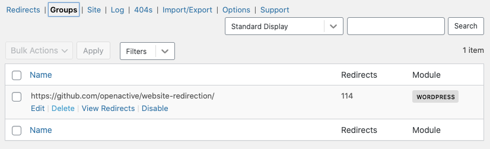
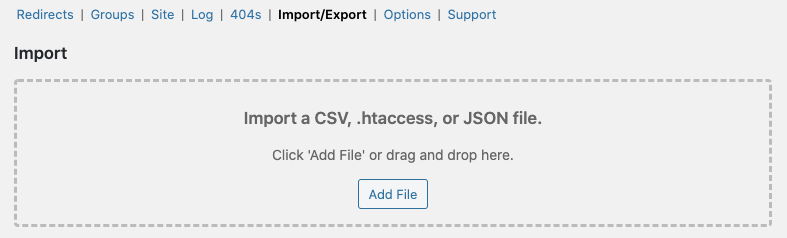
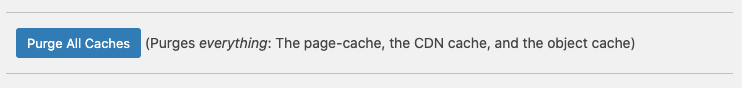

# Wordpress Redirection plugin configuration for `www.openactive.io`
This repository contains version-controlled configuration for the [Redirection Plugin](https://redirection.me/) within the www.openactive.io Wordpress website:

- [`redirection.json`](/redirection.json)

Details of the JSON format are available in the [plugin documentation](https://redirection.me/developer/json-export/).

## Contribution

To make changes to the redirect configuration of www.openactive.io, simply create a PR for the proposed change to [`redirection.json`](/redirection.json).

Please use the `"title"` property to describe the reason for the redirect.

The `master` branch represents the current state of redirects on the live website.

Note that redirects marked with "DO NOT EDIT" are essential for existing sytems or processes in the OpenActive ecosystem to function, and editing them will have unintended consequences.

## Deployment

To deploy updates to the website redirection configuration, follow the steps below:

1. Download [redirection.json](/redirection.json) from the `master` branch.
2. Delete the "`https://github.com/openactive/website-redirection/`" group from within the [Groups page of the Wordpress Redirection Plugin](https://www.openactive.io/wp-admin/tools.php?page=redirection.php&sub=groups).

3. Import `redirection.json` in the [Import/Export page of the Wordpress Redirection Plugin](https://www.openactive.io/wp-admin/tools.php?page=redirection.php&sub=io)

4. Click "Purge All Caches" in the [WP Engine General Settings page](https://www.openactive.io/wp-admin/admin.php?page=wpengine-common).

## Cloudflare Page Rules

There are a few cases where Wordpress Redirection is insufficient, and in these cases Cloudflare redirects have been used. See https://github.com/openactive/cloudflare-page-rules for more information.

## Cloudflare Reverse Proxy

Additional request pass-throughs are in place for backwards compatiblity of the `www` subdomain. See https://github.com/openactive/cloudflare-reverse-proxy#website-reverse-proxy for more information. 
