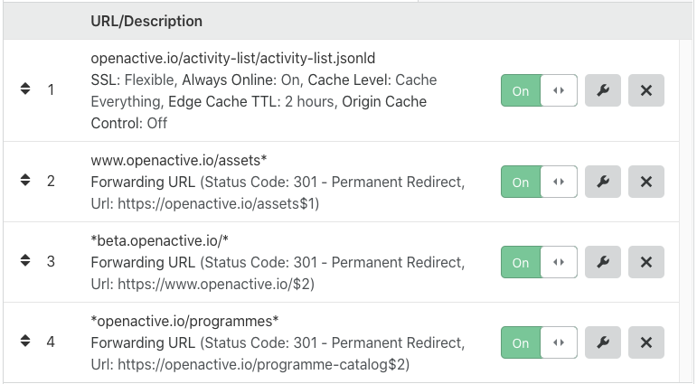

# Wordpress Redirection plugin configuration for `www.openactive.io`
This repository contains version-controlled configuration for the [Redirection Plugin](https://redirection.me/) within the www.openactive.io Wordpress website:

- [`redirection.json`](/redirection.json)

## Contribution

To make changes to the redirect configuration of www.openactive.io, simply create a PR for the proposed change to [`redirection.json`](/redirection.json).

Details of the JSON format are available in the [plugin documentation](https://redirection.me/developer/json-export/).

Please use the `"title"` property to describe the reason for the redirect.

The `master` branch represents the current state of redirects on the live website.

Note that redirects marked with "DO NOT EDIT" are essential for existing sytems or processes in the OpenActive ecosystem to function, and editing them will have unintended consequences.

## Deployment

To deploy updates to the website redirection configuration, follow the steps below:

1. Download [redirection.json](/redirection.json) from the `master` branch.
2. Delete the "`https://github.com/openactive/website-redirection/`" group from within the [Groups page of the Wordpress Redirection Plugin](https://www.openactive.io/wp-admin/tools.php?page=redirection.php&sub=groups).

3. Import `redirection.json` in the [Import/Export page of the Wordpress Redirection Plugin](https://www.openactive.io/wp-admin/tools.php?page=redirection.php&sub=io)

4. Click "Purge All Caches" in the [WP Engine General Settings page](https://www.openactive.io/wp-admin/admin.php?page=wpengine-common).

## Cloudflare Page Rules

There are a few cases where Wordpress Redirection is insufficient, and in these cases Cloudflare redirects have been used. These redirects have been documented below, and this documentation must be updated to match the latest configuration for any changes made to Cloudflare.

1. Ensures that the JSON-LD version the OpenActive Activity List is maximally cached, to minimise downtime.
2. Provides a redirect for all static assets previously hosted at the `www` subdomain (noting that the Wordpress Redirection Plugin does not handle binary static assets such as images).
3. Some external websites still reference the `beta.openactive.io` domain, from a previous version of the OpenActive website. This redirect ensures such references still resolve.
4. The Gladstone instructional video references "openactive.io/programmes" and does not specify `www`. This redirect ensures that this reference wills still resolve.

## Cloudflare Reverse Proxy

Additional request pass-throughs are in place for backwards compatiblity of the `www` subdomain. See https://github.com/openactive/cloudflare-reverse-proxy#website-reverse-proxy for more information. 
